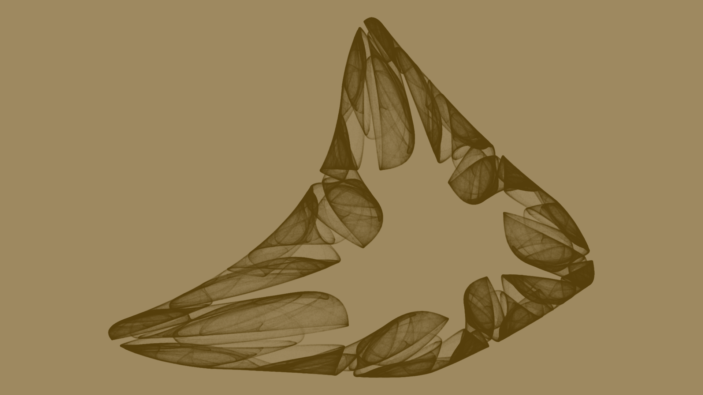
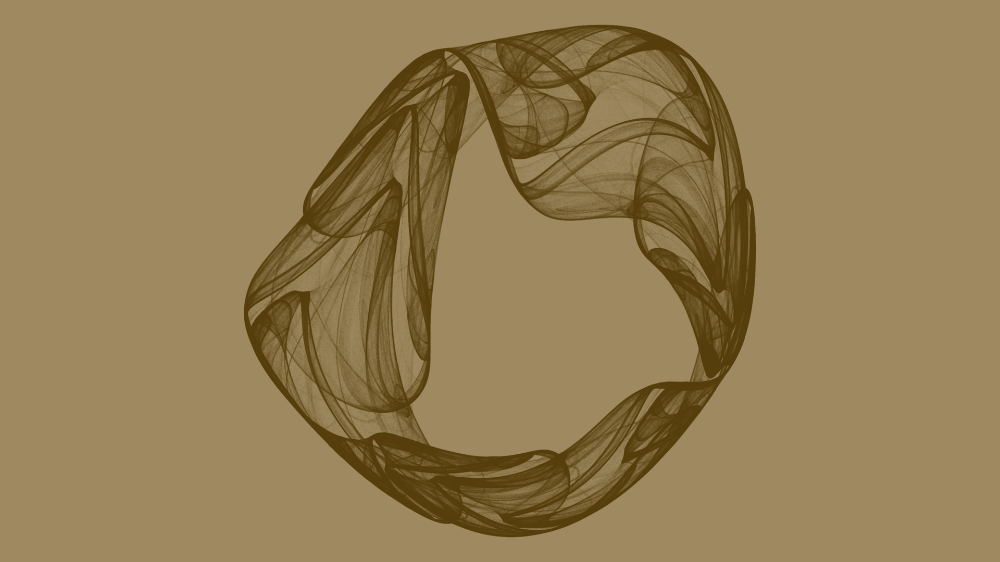
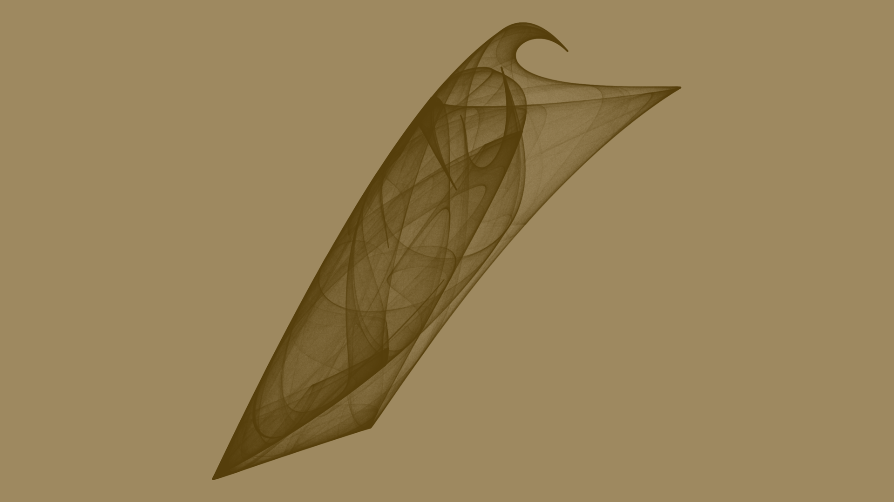

# Chaotic Attractor Wallpaper

Generate 2-D chaotic attractors and render them as wallpaper: crisp
line-art on a clean background. The parameter set is saved as a short
copy-pasteable **code** you can re-render at any time in any color or
size.

Two attractor families:

* **polynomial** (default): the 12-coefficient 2-D quadratic family from
  Paul Bourke's Lyapunov-attractor explorer (see [Credits](#credits)):

      x' = a0 + a1·x + a2·x² + a3·x·y + a4·y + a5·y²
      y' = b0 + b1·x + b2·x² + b3·x·y + b4·y + b5·y²

* **clifford**: the 8-parameter trigonometric family (Clifford A.
  Pickover, after Paul Richards' animation):

      x' = a·sin(b·y) + c·cos(d·x)
      y' = e·sin(f·x) + g·cos(h·y)

Every generated parameter set is validated with a real orbit and the
largest Lyapunov exponent before acceptance: diverging, periodic, and
point attractors are thrown away and re-drawn. Chaos is rare (roughly
1 in 30-80 random draws), so the tool keeps rolling until it has N good
ones.

Examples (each is re-renderable via the code in its filename, e.g.
`python3 attractor.py 351WDKN4AR0T1PPYD2A89H96G5GF2PMSR900F9A`):

| | | |
|---|---|---|
|  |  |  |
| `351WDKN4AR0T1PPYD2A89H96G5GF2PMSR900F9A` | `24VME8BDYD7HR72FXY7QWXW3TA1XST5ZRDS495S` | `015NFG9H3HDYAT2FFHV2MGG9NCFE4ZVQYBCH59M` |

### Why the examples look the way they do

All three are **polynomial** family attractors (the default `--family`):
one 12-coefficient quadratic map (the equations above) iterated ~20M
times.

* **Different shape per code.** Each code is a different random set of
  12 coefficients, and chaotic maps are hyper-sensitive to their
  parameters: a tiny change produces an entirely different pattern.
* **Lines are pass-counts.** `quad2d` counts how often the orbit visits
  each grid cell. The orbit is a 1-D curve in 2-D space, so most cells
  are never visited and a few get thousands of passes; the tone curve
  maps those counts to gray levels, so visited regions become thin dark
  filaments and the rest stays background.
* **The smoky halo is the blur.** A Gaussian blur on the density before
  the tone curve spreads each filament into a soft glow.
* **Color is a style option, not part of the attractor.** The code fixes
  the math, never the colors: I selected the brown-on-beige pair
  (`--fg #553E0B --bg #9E8960`) purely for example purposes. Color
  picking is available (`--fg`/`--bg`, any gray or hex), so any of the
  three can be re-rendered in any color from its code alone.

## Requirements

* **g++**: builds the C integrator (fast orbit integration + density grid)
* **Python 3.10+**
  * rendering needs **numpy** and **Pillow** (e.g. any venv with both)
  * generation-only runs (no rendering) work with plain Python 3

## Quick start

```sh
# build the integrator (once)
g++ -O2 -o quad2d quad2d.cpp

# one new random attractor, rendered to output/ (1920x1080 wallpaper)
python3 attractor.py

# five of them, reproducible
python3 attractor.py -n 5 --seed 42

# a Clifford-family one
python3 attractor.py --family clifford

# just generate parameter sets, no rendering (fast, no numpy needed)
python3 attractor.py -n 3 --params-only
```

Each run prints a code like `0FRC4DA8V6Y7FEE3EHZDAS17FFP8XZ60W5GP5Z4` and
writes, under `output/`:

```
output/<CODE>.cfg         hand-editable config (full-precision parameters,
                          bounds, start point, style)
output/images/<CODE>.png  the rendered wallpaper
output/raw/<CODE>.raw     binary density grid (quad2d output)
output/txt/<CODE>.txt     quad2d input file (bounds, start, coefficients)
```

### The code IS the configuration

The parameters are quantized (default 16 bits each ≈ 5 decimal digits) and
packed into one base32 code of letters + digits. Typing the code back in
re-renders that exact attractor:

```sh
python3 attractor.py 0FRC4DA8V6Y7FEE3EHZDAS17FFP8XZ60W5GP5Z4            # by code
python3 attractor.py output/0FRC4DA8V6Y7FEE3EHZDAS17FFP8XZ60W5GP5Z4.cfg # or by file
```

The `.cfg` file additionally stores the *full-precision* coefficients
(`exact` line), so re-renders from the file stay faithful (chaotic maps
amplify coarse parameters). Edit `fg`/`bg`/`sigma`/`pct`/`gamma` in the
`.cfg` (or pass them on the command line) to re-render the same attractor
in a different style.

### Useful options

```
--size 3840x2160   output canvas WxH (default 1920x1080; 1080x1920 portrait)
--res 2400         attractor resolution: long side of the density grid
                   (default 1600; higher = smoother lines, slower)
--fit cover        fill the canvas edge-to-edge and crop (default: contain)
--margin 0.03      contain: 3% breathing room per side
--fg #553E0B       foreground color: gray 0-255 or hex (default black)
--bg #9E8960       background color: gray 0-255 or hex (default white)
--sigma 1.2        blur: slightly softer strokes (default 1.0)
--pct 40           tone-curve knee percentile: lower = darker strokes
--gamma 0.9        tone-curve exponent
--bits 8           coarser codes (20 chars instead of 39)
--iters 40000000   denser, slower integration (default 20M)
--lyap-min 0.01    stricter chaos filter (fewer, "more chaotic" results)
--min-coverage .01 reject near-empty/filamentary orbits (default 0.005)
--outdir DIR       where the output tree goes (default: ./output)
```

## How it works

Two stages, split so the expensive part stays in C:

```
 ┌────────────┐    orbit + pass-counts    ┌──────────────┐   tone map,   ┌────────────┐
 │   quad2d   │ ── float density grid ──► │ attractor.py │ ── color ───► │ wallpaper  │
 │   (C++)    │       (<CODE>.raw)        │   (Python)   │               │    .png    │
 └────────────┘                           └──────────────┘               └────────────┘
```

1. **quad2d** integrates the orbit (default 20M steps) and accumulates a
   per-cell pass count in a 32-bit float density grid over the bounding
   box (expanded 10% margin). Raw occupancy only, no tone curve. It also
   reports stats and the orbit's *true* extent, so the driver can re-run
   with a grown box if the validation orbit undershot the full orbit.
2. **attractor.py** tone-maps the grid with a full-precision separable
   Gaussian blur *before* the tone curve (blurring after the curve leaves
   thin lines; blurring the density builds the soft smoky halo):

       gray = max(floor, 255 · (1 − (1 − e^(−d/K))^gamma))

   with `K` auto-picked per attractor as the `--pct` percentile of the
   density, so strokes read well without harsh black. The result is
   centered on the wallpaper canvas in `--fit contain|cover` style.

## File map

| File | What it is |
|---|---|
| `attractor.py` | The main tool: random generation, Lyapunov validation, code encode/decode, quad2d driver, tone map, wallpaper layout |
| `quad2d.cpp` | The C integrator (both families): orbit → raw float density grid |
| `fractal.py` | **Adapted**: original Bourke/Lindegaard Lyapunov explorer; 100k-point search that saves `output/N.txt` + crude 500px PNG. The historical source of the polynomial family and the `.txt` param-file format |
| `clifford.cpp` | **Adapted**: Paul Richards' Clifford parameter-sweep animation (color, PPM output). Kept for reference/attribution; the pipeline uses the *polynomial* + *clifford* families via `quad2d`, not this file |
| `tonemap.py` | Standalone stage-2 utility: tone-map a `*.raw` grid to grayscale PNG (the "smoky wash" recipe) |
| `render_batch.py` | Standalone utility: render several `output/N.raw` grids as high-res smoky PNGs with auto-picked K |
| `render_crisp.py` | Standalone utility: plot `output/N.txt` orbits as crisp line-art on white (the old fractal.py look, but large) |
| `ask_vision.py` | Utility: send images + a question to the local LLM server (`:8080`), used during development to visually compare renders |
| `output/` | Generated artifacts: `.cfg` files (the catalog of codes) at the top level, then `images/<CODE>.png`, `raw/<CODE>.raw`, `txt/<CODE>.txt`. The raw grids are binary and git-ignored; `output/images/favourites/` is a local scratch folder for your own picks and is also ignored |
| `examples/` | A few rendered wallpapers (re-renderable via their filename codes) |

Build the C part:

```sh
g++ -O2 -o quad2d quad2d.cpp
g++ -O2 -o clifford clifford.cpp     # optional; reference animation
./quad2d output/<CODE>.txt           # re-integrate one: writes <CODE>.raw
```

## Credits

Original work by **Felix Meli (felnx)** using Qwen-3.8-27B. Parts of this project are adapted
from, or inspired by, the following:

* **Paul Bourke**: the 2-D quadratic "Lyapunov" attractor family and the
  Lyapunov-exponent search/validation method, from his
  [fractal explorer](http://local.wasp.uwa.edu.au/~pbourke/fractals/lyapunov/)
  (`gen.c`). The "polynomial" family, the `.txt` parameter-file format, and
  the diverging/periodic/chaotic classification all come from here.
* **Johan Bichel Lindegaard** ([johan.cc](http://johan.cc)): Python port of
  Bourke's `gen.c` (`fractal.py` in this repo), which is the direct ancestor
  of `attractor.py`'s generation and validation code.
* **Paul Richards**: Clifford-attractor parameter-sweep animation
  ([`main.cpp`](http://paulbourke.net/fractals/clifford/paul_richards/main.cpp),
  published on Paul Bourke's site), the source of `clifford.cpp` in this repo.
* **Clifford A. Pickover**: the Clifford attractor family itself.

Note on licenses: the code authored in this repo (attractor.py, quad2d.cpp,
tonemap.py, render_*.py, ask_vision.py) is released under the MIT License
(see `LICENSE`). The adapted files `fractal.py` (Lindegaard) and
`clifford.cpp` (Richards) don't state a license; they are kept here unmodified
aside from attribution headers and one small compile-time-override addition in
`clifford.cpp`, for reference and attribution. If you intend to redistribute
this repo, consider reaching out to the original authors or dropping those
two files.

## License

MIT, see [LICENSE](LICENSE) (applies to the original code in this repo;
see [Credits](#credits) for the adapted files).
